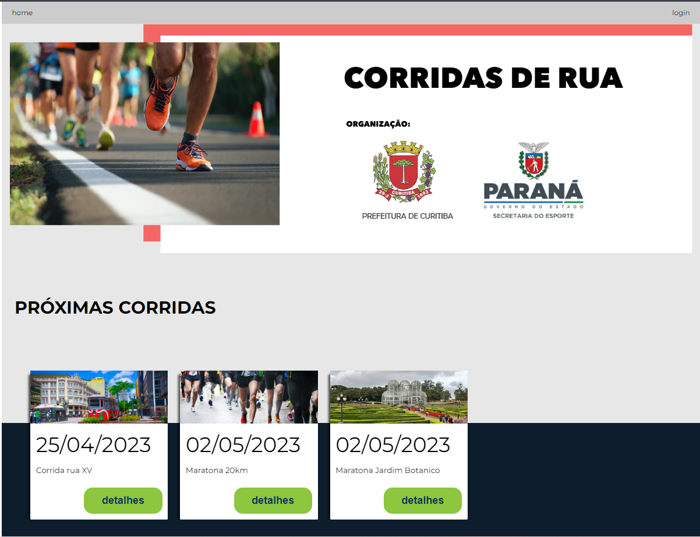
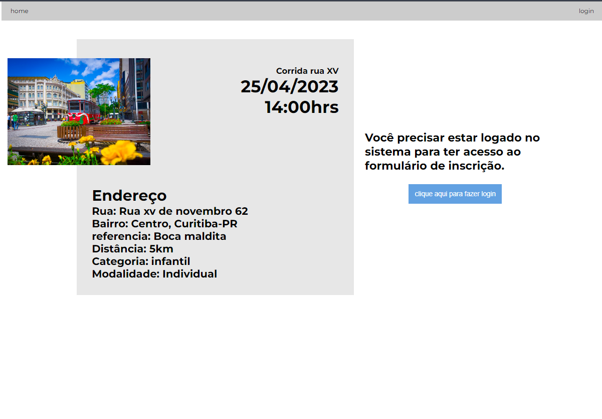
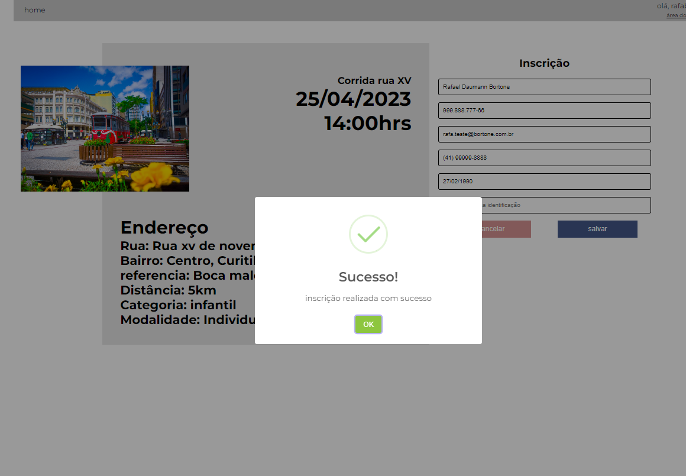
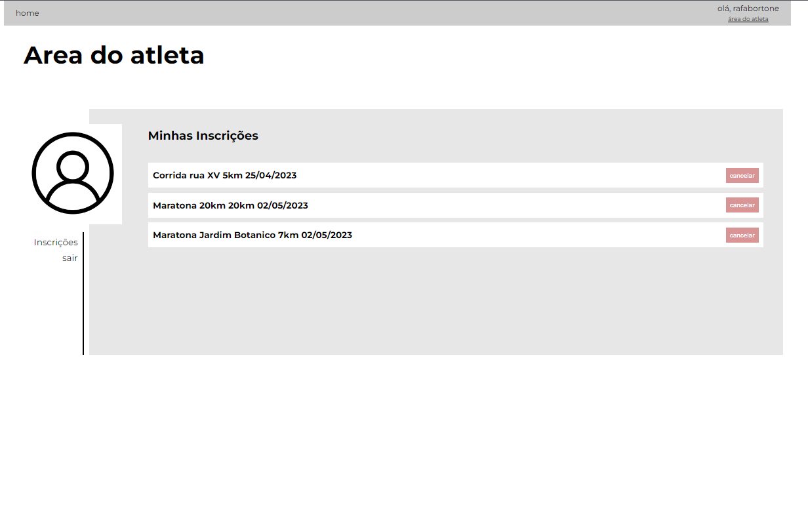
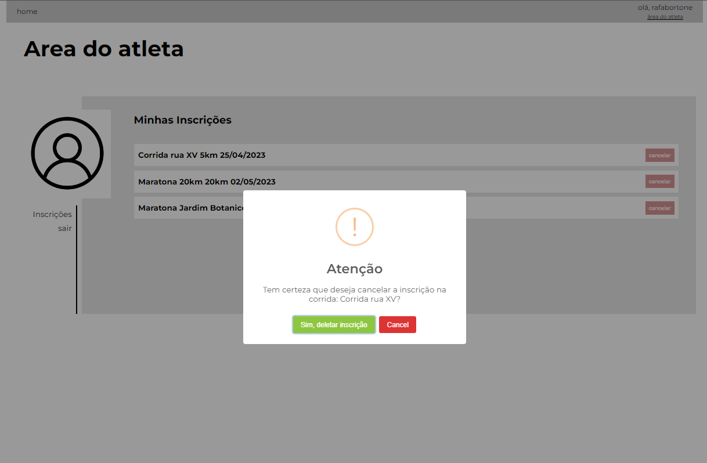
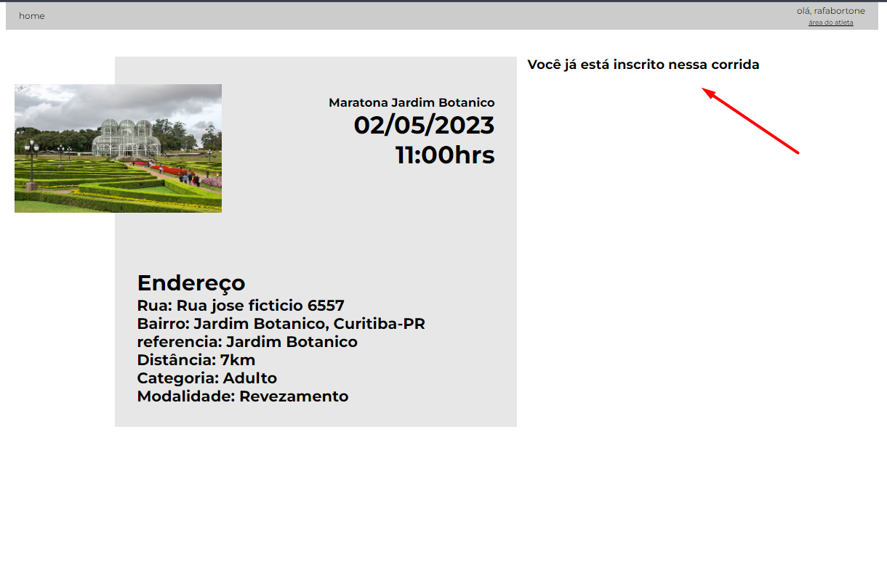

Protótipo de sistema para controle de inscrições em corridas de rua.  
- Home lista as próximas corridas que irão acontecer. 
- Detalhes da corrida lista todas as informações da corrida selecionada.
- Formulário de inscrição só aparece se o usuário estiver logado e se ainda não se inscreveu na corrida selecionada.
- Area do atleta lista as inscrições realizadas podendo o usuário cancelar a inscrição.

- React, React hooks, Context api, Sass, Interface responsiva
- Controle de acesso, controle de estados do sistema. 

Pra logar no sistema:
- usuário: rafabortone;
- senha: 123456;
 
Acesse: https://rafabortone.github.io/corridas/ 

## Available Scripts

In the project directory, you can run:

### `yarn start`

Runs the app in the development mode.\
Open [http://localhost:3000](http://localhost:3000) to view it in the browser.

The page will reload if you make edits.\
You will also see any lint errors in the console.

### `yarn test`

Launches the test runner in the interactive watch mode.\
See the section about [running tests](https://facebook.github.io/create-react-app/docs/running-tests) for more information.

### `yarn build`

Builds the app for production to the `build` folder.\
It correctly bundles React in production mode and optimizes the build for the best performance.

The build is minified and the filenames include the hashes.\
Your app is ready to be deployed!

See the section about [deployment](https://facebook.github.io/create-react-app/docs/deployment) for more information.

### Advanced Configuration

This section has moved here: [https://facebook.github.io/create-react-app/docs/advanced-configuration](https://facebook.github.io/create-react-app/docs/advanced-configuration)

